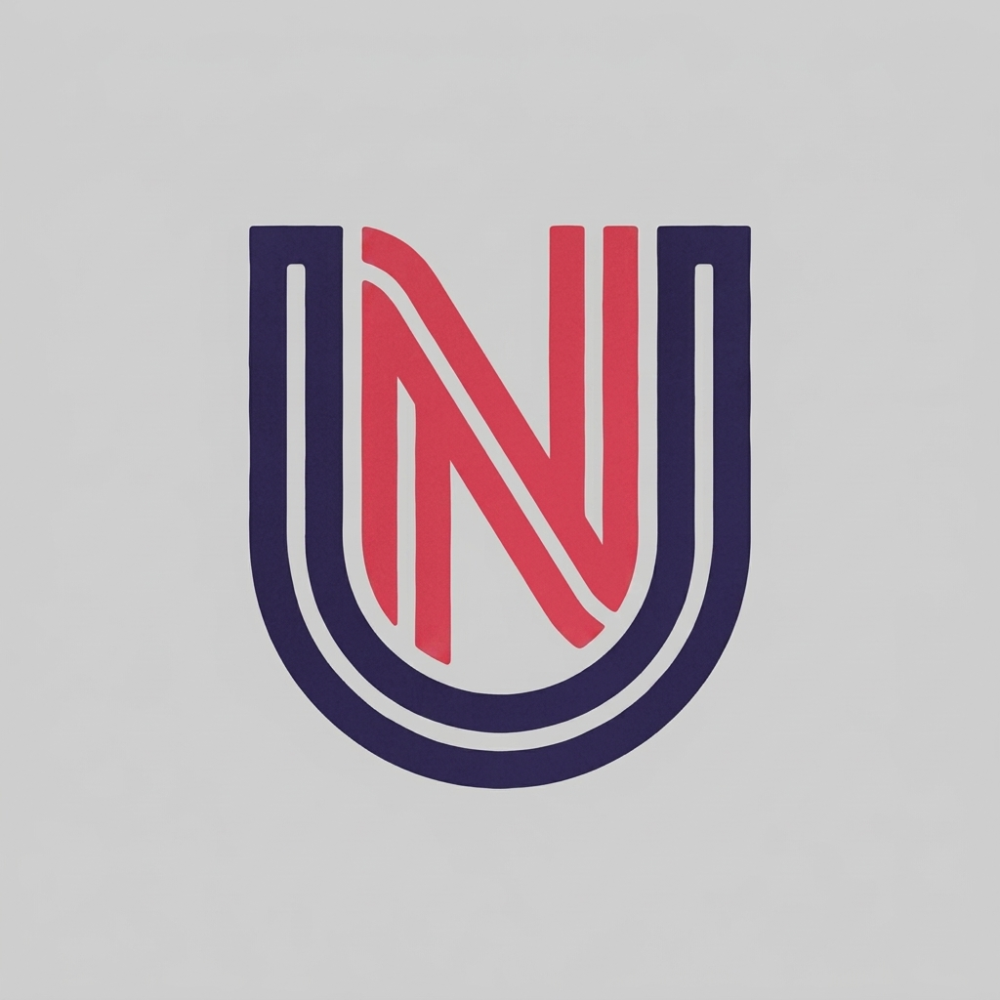
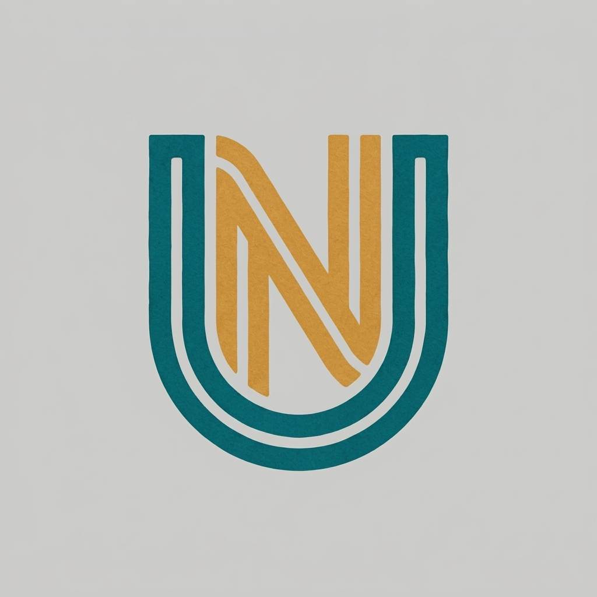
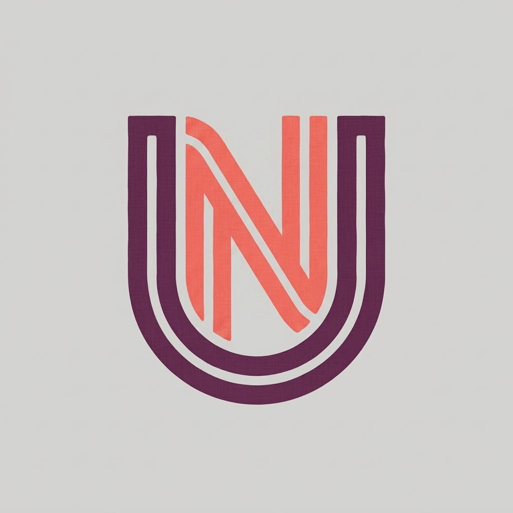
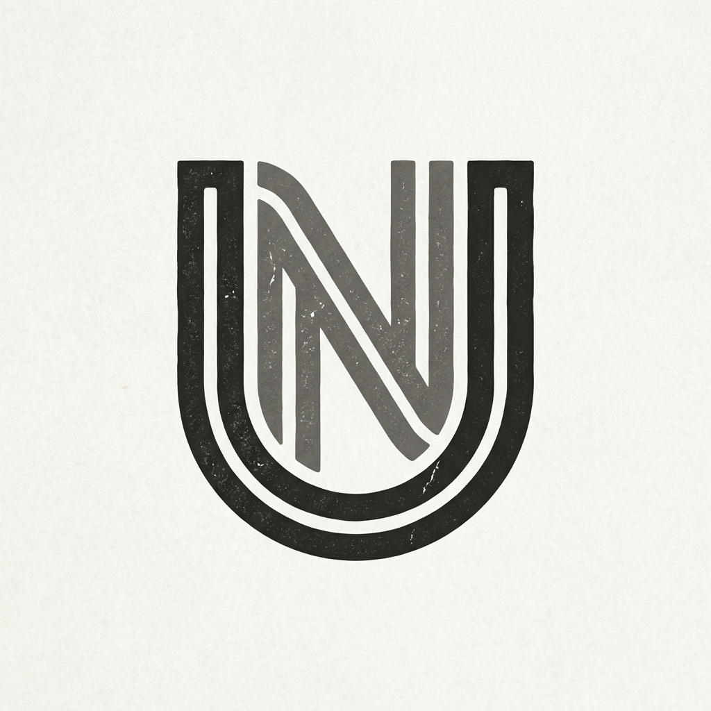

# Logo Tasarım Önerileri - ultnexus.com

www.ultnexus.com için belirlediğiniz **"U harfi içerisinde N harfi"** (Concept 3'ün çizgileri üzerinden) şeklini temel alarak, sitenizin yeni konseptine (**film, dizi, kitap, anime**) uygun, daha canlı ama yine mat ve sanatsal 3 yeni varyasyon oluşturulmuştur.

---

## 🎨 Yeni Varyasyonlar (Seçilen Şekil Üzerinden)

### 🎬 Varyasyon 1: Gün Batımı Kızılı & Derin İndigo

* **Renkler:** Mat gün batımı kızılı (kırmızı tonu) ve derin, sıcak indigonun (gece gökyüzü mavisi) uyumu.
* **Tematik Çağrışım:** 
  * **Kızıl:** Sinema perdesi, anime enerjisi ve aksiyon/heyecan.
  * **İndigo:** Derin hikayeler, romanlar ve gece vakti film/dizi izleme keyfi.
* **Hissiyat:** Canlı, çekici ama kurumsal ağırlığını ve sanatsal dokusunu koruyan bir tasarım.

---

### 📖 Varyasyon 2: Canlı Turkuaz & Kehribar Sarısı

* **Renkler:** Canlı petrol turkuazı (teal) ve sıcak kehribar sarısı (amber gold).
* **Tematik Çağrışım:** 
  * **Turkuaz:** Fantastik dünyalar, kitap sayfalarındaki yaratıcılık ve derinlik.
  * **Kehribar:** Popüler kültür, anime parıltısı ve sıcak hikayeler.
* **Hissiyat:** Kontrastı yüksek, dinamik, genç ve modern bir kültür portalı hissi uyandırıyor.

---

### 🎭 Varyasyon 3: Mercan Pembesi & Mürdüm Moru

* **Renkler:** Yumuşak ama canlı mercan pembesi/kırmızısı ve derin mürdüm (erik) moru.
* **Tematik Çağrışım:** 
  * **Mercan:** Görsel sanatlar, anime dünyası ve eğlence.
  * **Mürdüm:** Romanlardaki dramatik tonlar, prestijli bağımsız filmler ve gizem.
* **Hissiyat:** Oldukça sanatsal, sıcak, davetkar ve premium bir kültürel topluluk havası taşıyor.

---

## 🏛️ Referans Alınan İlk Şekil (Konsept 3 - Gri/Taş)
Sadece karşılaştırma yapabilmeniz için, temel alınan ilk gri/taş rengi tasarım:

